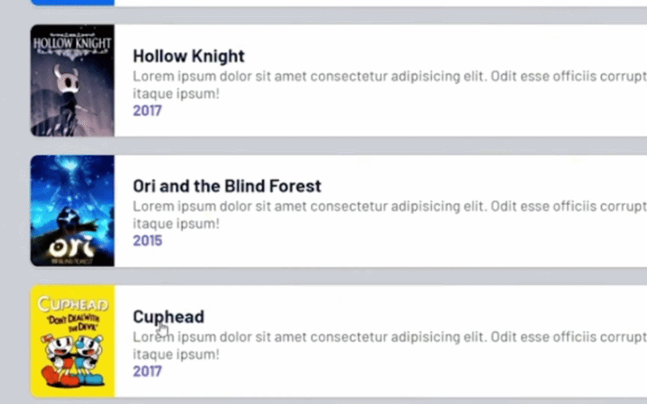

# 🎮 DSList

## Sobre o projeto

DSList é um projeto de portfólio desenvolvido durante o evento Intensivão Java Spring. Consiste em uma API RESTful para gerenciar jogos e coleções de jogos e demonstrar boas práticas de desenvolvimento backend.

## Modelo Conceitual


## Tecnologias Utilizadas
- Java 21+
- Spring Boot
- Hibernate/JPA
- Maven
- H2 Database
- PostgreSQL

## Endpoints
### Obter todos os jogos
* **URL:** `/api/games`
* **Método:** `GET`
* **Resposta: (200 OK)**
<details>
  <summary>Retorno em formato JSON</summary>
  
```json
[
    {
        "id": 1,
        "title": "Mass Effect Trilogy",
        "year": 2012,
        "imgUrl": "https://raw.githubusercontent.com/devsuperior/java-spring-dslist/main/resources/1.png",
        "shortDescription": "Lorem ipsum dolor sit amet consectetur adipisicing elit. Odit esse officiis corrupti unde repellat non quibusdam! Id nihil itaque ipsum!"
    },
    {
        "id": 2,
        "title": "Red Dead Redemption 2",
        "year": 2018,
        "imgUrl": "https://raw.githubusercontent.com/devsuperior/java-spring-dslist/main/resources/2.png",
        "shortDescription": "Lorem ipsum dolor sit amet consectetur adipisicing elit. Odit esse officiis corrupti unde repellat non quibusdam! Id nihil itaque ipsum!"
    },
    {
        "id": 3,
        "title": "The Witcher 3: Wild Hunt",
        "year": 2014,
        "imgUrl": "https://raw.githubusercontent.com/devsuperior/java-spring-dslist/main/resources/3.png",
        "shortDescription": "Lorem ipsum dolor sit amet consectetur adipisicing elit. Odit esse officiis corrupti unde repellat non quibusdam! Id nihil itaque ipsum!"
    },
    {
        "id": 4,
        "title": "Sekiro: Shadows Die Twice",
        "year": 2019,
        "imgUrl": "https://raw.githubusercontent.com/devsuperior/java-spring-dslist/main/resources/4.png",
        "shortDescription": "Lorem ipsum dolor sit amet consectetur adipisicing elit. Odit esse officiis corrupti unde repellat non quibusdam! Id nihil itaque ipsum!"
    },
    {
        "id": 5,
        "title": "Ghost of Tsushima",
        "year": 2012,
        "imgUrl": "https://raw.githubusercontent.com/devsuperior/java-spring-dslist/main/resources/5.png",
        "shortDescription": "Lorem ipsum dolor sit amet consectetur adipisicing elit. Odit esse officiis corrupti unde repellat non quibusdam! Id nihil itaque ipsum!"
    },
    {
        "id": 6,
        "title": "Super Mario World",
        "year": 1990,
        "imgUrl": "https://raw.githubusercontent.com/devsuperior/java-spring-dslist/main/resources/6.png",
        "shortDescription": "Lorem ipsum dolor sit amet consectetur adipisicing elit. Odit esse officiis corrupti unde repellat non quibusdam! Id nihil itaque ipsum!"
    },
    {
        "id": 7,
        "title": "Hollow Knight",
        "year": 2017,
        "imgUrl": "https://raw.githubusercontent.com/devsuperior/java-spring-dslist/main/resources/7.png",
        "shortDescription": "Lorem ipsum dolor sit amet consectetur adipisicing elit. Odit esse officiis corrupti unde repellat non quibusdam! Id nihil itaque ipsum!"
    },
    {
        "id": 8,
        "title": "Ori and the Blind Forest",
        "year": 2015,
        "imgUrl": "https://raw.githubusercontent.com/devsuperior/java-spring-dslist/main/resources/8.png",
        "shortDescription": "Lorem ipsum dolor sit amet consectetur adipisicing elit. Odit esse officiis corrupti unde repellat non quibusdam! Id nihil itaque ipsum!"
    },
    {
        "id": 9,
        "title": "Cuphead",
        "year": 2017,
        "imgUrl": "https://raw.githubusercontent.com/devsuperior/java-spring-dslist/main/resources/9.png",
        "shortDescription": "Lorem ipsum dolor sit amet consectetur adipisicing elit. Odit esse officiis corrupti unde repellat non quibusdam! Id nihil itaque ipsum!"
    },
    {
        "id": 10,
        "title": "Sonic CD",
        "year": 1993,
        "imgUrl": "https://raw.githubusercontent.com/devsuperior/java-spring-dslist/main/resources/10.png",
        "shortDescription": "Lorem ipsum dolor sit amet consectetur adipisicing elit. Odit esse officiis corrupti unde repellat non quibusdam! Id nihil itaque ipsum!"
    }
]
```
</details>

---

### Obter jogo por id
* **URL: `/api/games/{id}`**
* **Método: `GET`**
* **Resposta: (200 OK)**

```json
{
    "id": 5,
    "title": "Ghost of Tsushima",
    "year": 2012,
    "genre": "Role-playing (RPG), Adventure",
    "platforms": "Xbox, Playstation, PC",
    "score": 4.6,
    "imgUrl": "https://raw.githubusercontent.com/devsuperior/java-spring-dslist/main/resources/5.png",
    "shortDescription": "Lorem ipsum dolor sit amet consectetur adipisicing elit. Odit esse officiis corrupti unde repellat non quibusdam! Id nihil itaque ipsum!",
    "longDescription": "Lorem ipsum dolor sit amet consectetur adipisicing elit. Delectus dolorum illum placeat eligendi, quis maiores veniam. Incidunt dolorum, nisi deleniti dicta odit voluptatem nam provident temporibus reprehenderit blanditiis consectetur tenetur. Dignissimos blanditiis quod corporis iste, aliquid perspiciatis architecto quasi tempore ipsam voluptates ea ad distinctio, sapiente qui, amet quidem culpa."
}
```

---

### Obter listas
* **URL: `/api/lists`**
* **Método: `GET`**
* **Resposta: (200 OK)**

```json
[
    {
        "id": 1,
        "name": "Aventura e RPG"
    },
    {
        "id": 2,
        "name": "Jogos de plataforma"
    }
]
```

---

### Obter jogos de uma lista
* **URL: `/api/lists/{id}/games`**
* **Método: `GET`**
* **Resposta: (200 OK)**

<details>
  <summary>Retorno em formato JSON</summary>
  
```json
[
    {
        "id": 6,
        "title": "Super Mario World",
        "year": 1990,
        "imgUrl": "https://raw.githubusercontent.com/devsuperior/java-spring-dslist/main/resources/6.png",
        "shortDescription": "Lorem ipsum dolor sit amet consectetur adipisicing elit. Odit esse officiis corrupti unde repellat non quibusdam! Id nihil itaque ipsum!"
    },
    {
        "id": 7,
        "title": "Hollow Knight",
        "year": 2017,
        "imgUrl": "https://raw.githubusercontent.com/devsuperior/java-spring-dslist/main/resources/7.png",
        "shortDescription": "Lorem ipsum dolor sit amet consectetur adipisicing elit. Odit esse officiis corrupti unde repellat non quibusdam! Id nihil itaque ipsum!"
    },
    {
        "id": 8,
        "title": "Ori and the Blind Forest",
        "year": 2015,
        "imgUrl": "https://raw.githubusercontent.com/devsuperior/java-spring-dslist/main/resources/8.png",
        "shortDescription": "Lorem ipsum dolor sit amet consectetur adipisicing elit. Odit esse officiis corrupti unde repellat non quibusdam! Id nihil itaque ipsum!"
    },
    {
        "id": 9,
        "title": "Cuphead",
        "year": 2017,
        "imgUrl": "https://raw.githubusercontent.com/devsuperior/java-spring-dslist/main/resources/9.png",
        "shortDescription": "Lorem ipsum dolor sit amet consectetur adipisicing elit. Odit esse officiis corrupti unde repellat non quibusdam! Id nihil itaque ipsum!"
    },
    {
        "id": 10,
        "title": "Sonic CD",
        "year": 1993,
        "imgUrl": "https://raw.githubusercontent.com/devsuperior/java-spring-dslist/main/resources/10.png",
        "shortDescription": "Lorem ipsum dolor sit amet consectetur adipisicing elit. Odit esse officiis corrupti unde repellat non quibusdam! Id nihil itaque ipsum!"
    }
]
```
</details>

---

### Reposicionar um jogo na lista com base na posição
* **URL: `/api/lists/{listId}/replacement`**
* **Método: `POST`**
* **Corpo da requisição (Body):**
```json
{
    "sourceIndex" : 3,
    "destinationIndex" : 1
}
```

